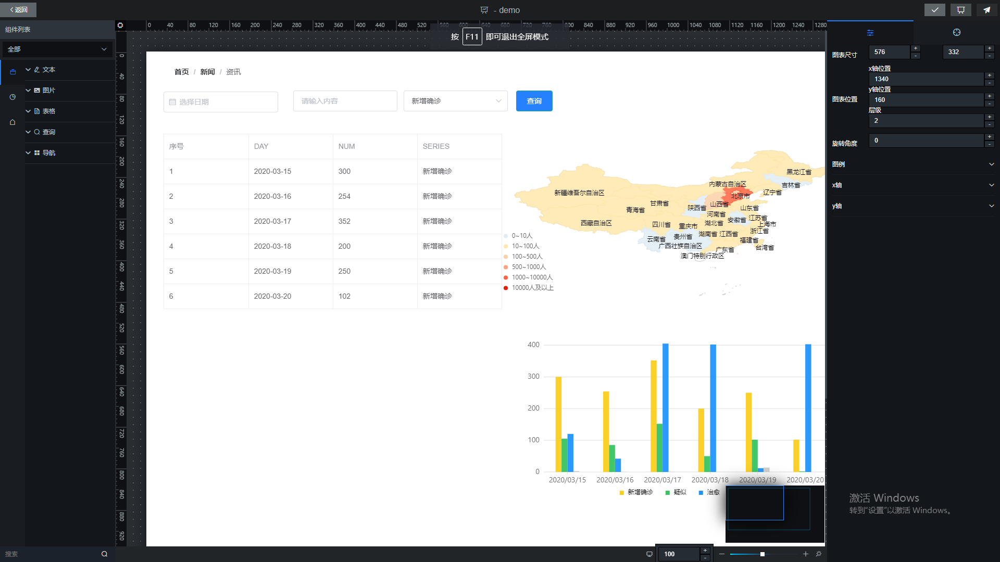
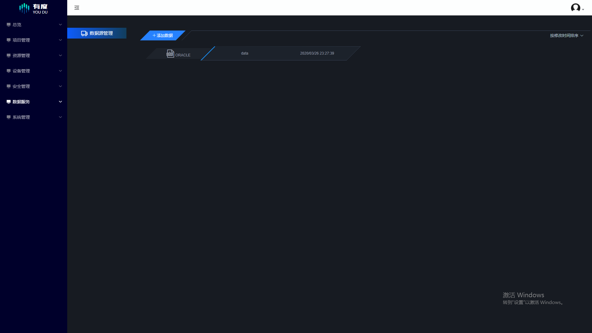
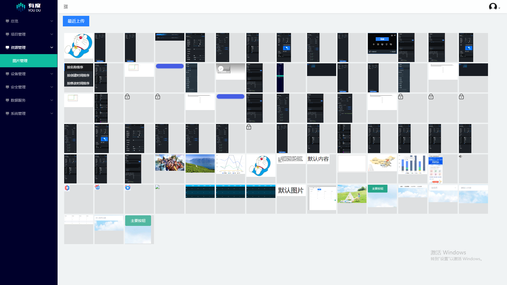

## 开发文档
请访问 https://lizhensheng.github.io/vue-data-view/

## 正在开发dataV的封装组件,持续更新,欢迎star,或者贡献代码

## 简介

* DataView是一个基于**Vue**的数据可视化设计框架
* 提供用于可拖拽的控件
* 提供常用的**图表**如折线图等
* 表格,图片,文字组件
* 一键生成数据大屏
* 集成高级查询语法

## 截图 / Screenshot









## 开发 / Develop

### 前端部分：Vue.js

#### Project setup

```
npm install
```

#### Compiles and hot-reloads for development

```
npm run dev-client
```

#### Compiles and minifies for production

```
npm run dev-server
```

### 后端部分：Node.js + Koa + MongoDB

准备工作：配置并运行 MongoDB 数据库，导入db-file目录下的文件即可

```bash
mongoimport --db admin --collection componentconfig --type json --file ./db-file/admin/componentconfig.json
mongoimport --db admin --collection connection --type json --file ./db-file/admin/connection.json
mongoimport --db admin --collection groupcomponent --type json --file ./db-file/admin/groupcomponent.json
mongoimport --db admin --collection image --type json --file ./db-file/admin/image.json
mongoimport --db admin --collection menu --type json --file ./db-file/admin/menu.json
mongoimport --db admin --collection project --type json --file ./db-file/admin/project.json
mongoimport --db admin --collection token --type json --file ./db-file/admin/token.json
mongoimport --db admin --collection user --type json --file ./db-file/admin/user.json
```

通过如下命令可以获取上面导入mongo的命令
```node
let fs = require('fs')
let files = fs.readdirSync('./db-file/admin')
let jsonFiles = files.filter(file => file.includes('.json') && !file.includes('metadata.json'))
let commands = jsonFiles.map(file => `mongoimport --db admin --collection ${file.replace('.json', '')} --type json --file ./db-file/admin/${file}`)

console.log(commands.join('\r\n'))
```
