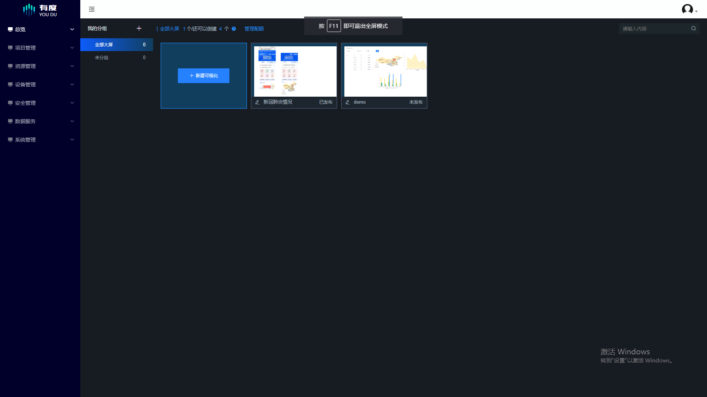
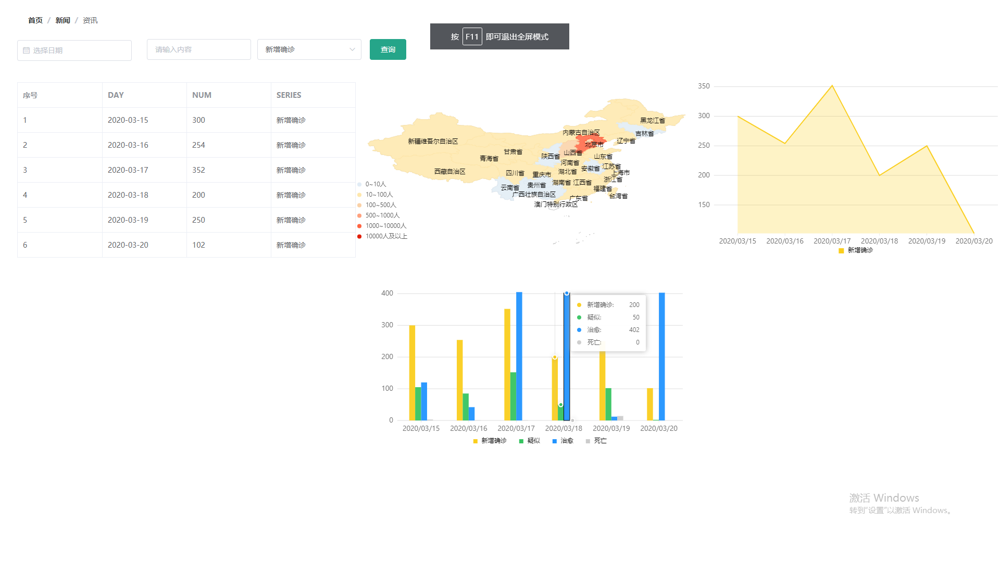

## 简介

* DataView是一个基于**Vue**的数据可视化设计框架
* 提供用于可拖拽的控件
* 提供常用的**图表**如折线图等
* 表格,图片,文字组件
* 一键生成数据大屏
* 集成高级查询语法

## 截图 / Screenshot







## 开发 / Develop

### 前端部分：Vue.js

#### Project setup

```
npm install
```

#### Compiles and hot-reloads for development

```
npm run dev-client
```

#### Compiles and minifies for production

```
npm run dev-server
```

### 后端部分：Node.js + Koa + MongoDB

准备工作：配置并运行 MongoDB 数据库，导入db-file目录下的文件即可

